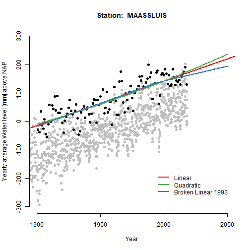
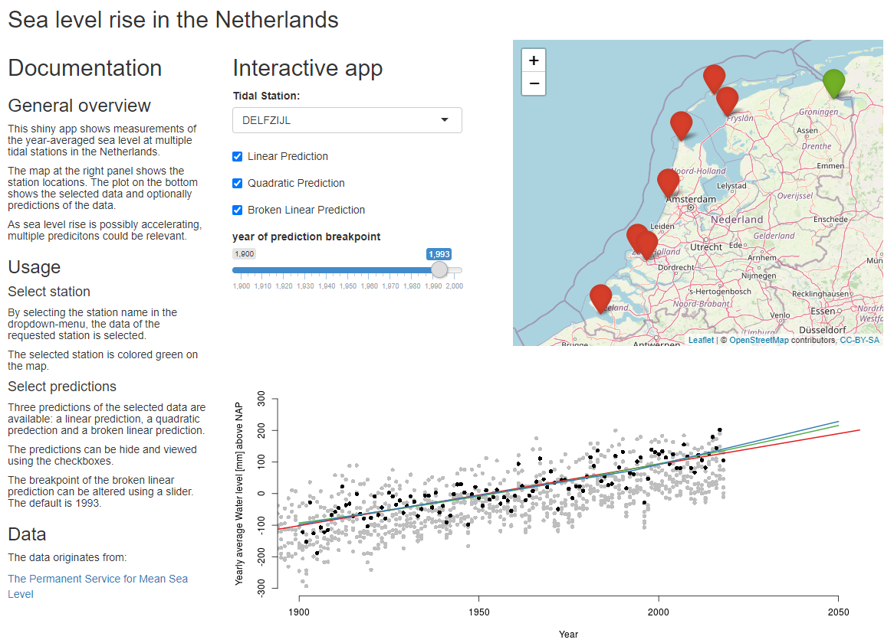

Peer Graded Assignment Course Project - Reproducible Pitch
========================================================
author: RLC Velhorst
date: 2020-06-03
autosize: true

# Sea level rise in the Netherland


Developing Data Products Assignment Week 4
========================================================

This document is the Pitch of the Peer Assessment project of week 4 from Coursera's course Developing Data Products, as part of the Specialization in Data Science by John Hopkins University. It was built in RStudio, using its R Presenter functionality. 

## Project Goal  

* Use of R Presenter
* Pitch of Shiny App

Data: Publicly Available Tide Stations
========================================================
The specific data in this exercise shows historical sea level in the Netherlands.  

The data used for this assignment originates from the Permanent Service for Mean Sea Level.
PSMSL is the global data bank for long term sea level change information from tide gauges and bottom pressure recorders  (for more info see [psmsl.org](https://www.psmsl.org/)).

This doument shows a selection of average sea level measurements in the Netherlands, which are stored in de publicly available data: tide gauge data [Holgate et al., 2013; PSMSL, 2020].


```
   id      lat      lon             name
7   9 51.91750 4.249722        MAASSLUIS
17 20 51.44222 3.596111       VLISSINGEN
19 22 51.97750 4.120000 HOEK VAN HOLLAND
```

Dutch Sea Levels
========================================================

Over the 20th century, sea levels have been rising. An important question is "how fast?". Subsequently, it is relevant to see if the rise is linear, or maybe accelerating. Therefore multiple predictions are calculated of the data. 




Shiny App
========================================================
I developed a Shiny App to interactively expore Dutch Sea Level data.
Click [this link](https://velhorst.shinyapps.io/PeerGradedAssignment-CourseProject-ShinyApplication/?_ga=2.131323851.551582778.1591127640-1268744059.1591127640) to visit the App!


